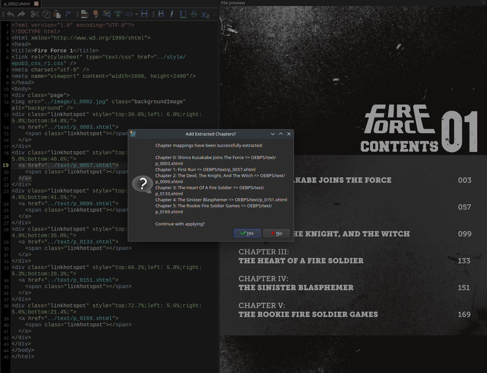

# Manga Chapter Extractor Editor Plugin

## Configuration
This Plugin requires access to an OpenAPI-compatible API endpoint

It comes configured by default with Google Generative AI (Gemini 2.0 Flash),
however any OpenAI-compatible endpoint should work (Ollama included).

I cannot guarantee the results for locally-run LLMs as I didn't get great
image OCR - best was with Mistral Small 3.1.

## Usage
This plugin requires a 'Contents' entry to be present in the book Table of
Contents. This can be added manually using the Ebook Editor.

## Workflow
If there are links present on the page, the plugin will use those to match
Contents entries against.

If there are no links present, the plugin provides the LLM with the list of
page filepaths in the ebook and estimates the page links, going from the
contents page.

I do not know what would happen if the Contents page doesn't contain page
numbers alongside the chapter names, however I suspect you might get some
imaginary numbers. I'm not an expert prompter...

You will be prompted to accept or reject the proposed chapters.

